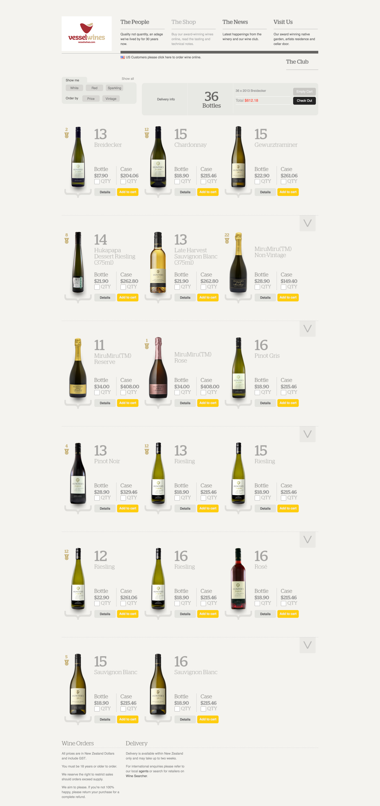

# VESSEL WINES

##Web application to order wines.

### Instructions
1. Convert the concept in the below image in to HTML/CSS, pixel perfect
2. Create a data source endpoint (API) 
3. Add/remove items from cart
4. Count items, amount as is on the concept
5. Create an endpoint (API) for placing an order.
6. Checkout on the same page.

